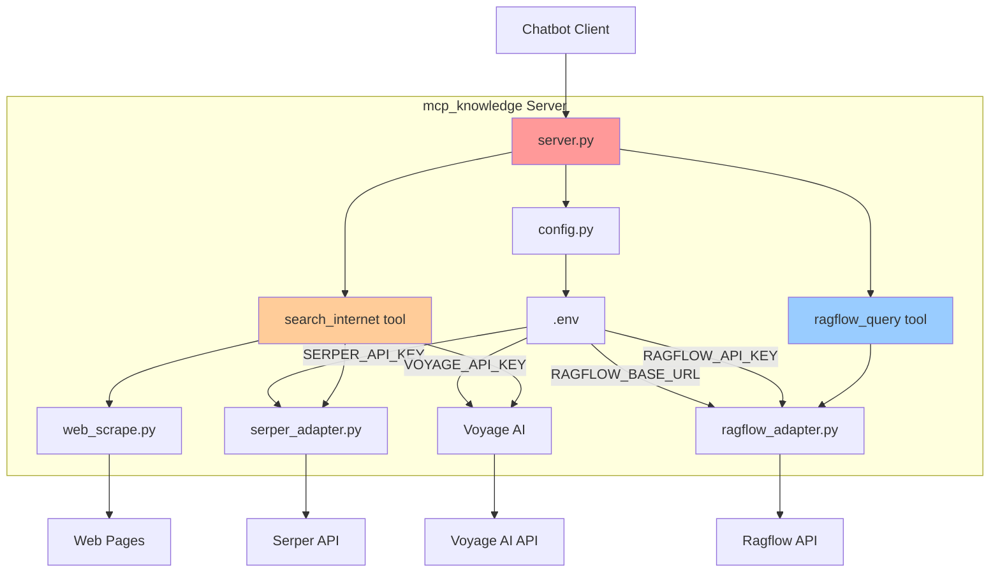
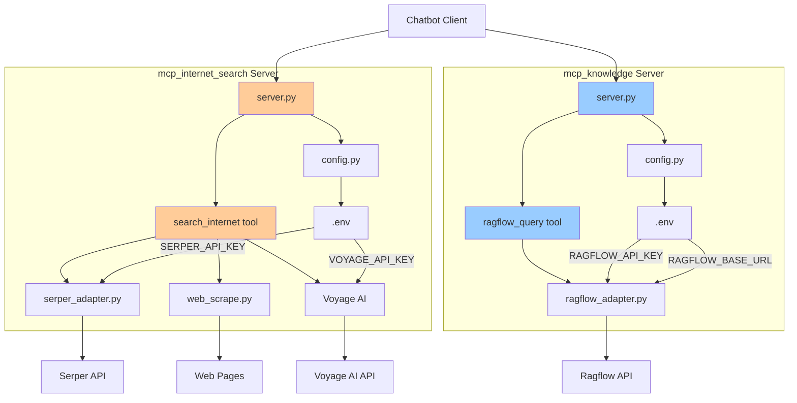
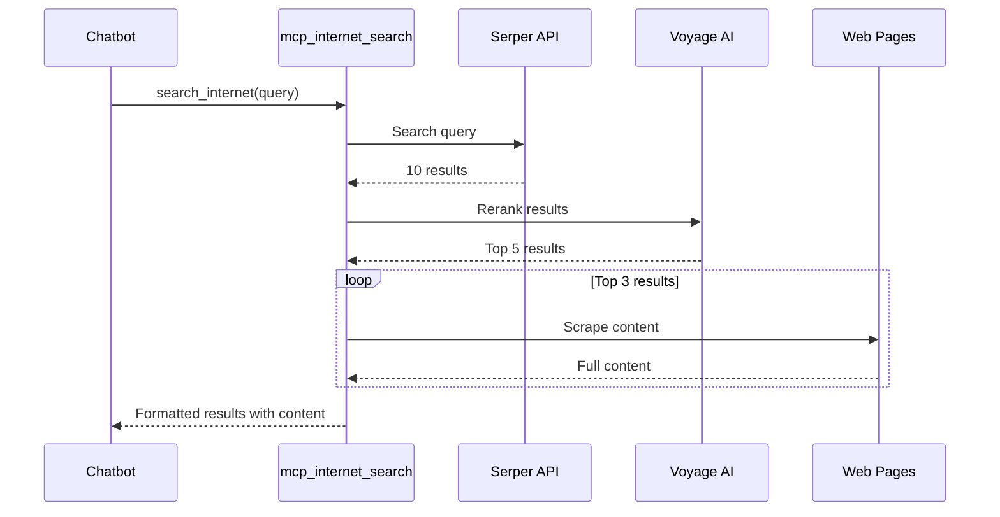
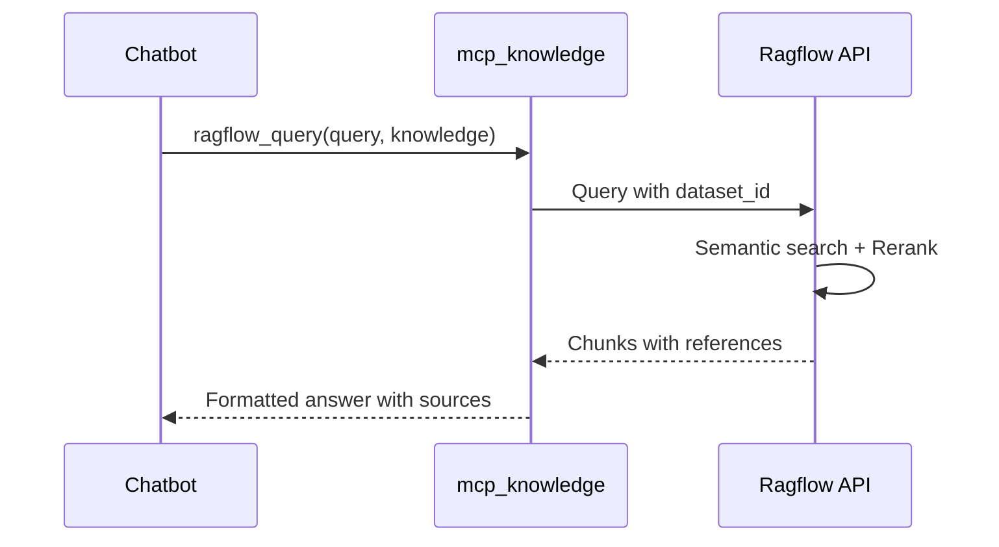
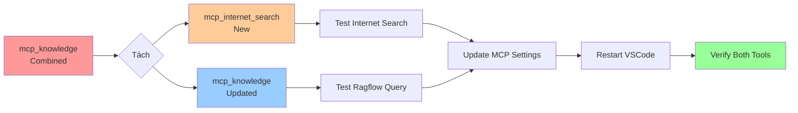
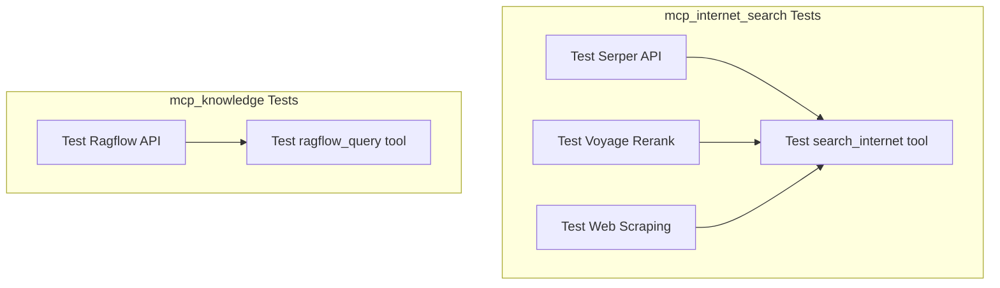
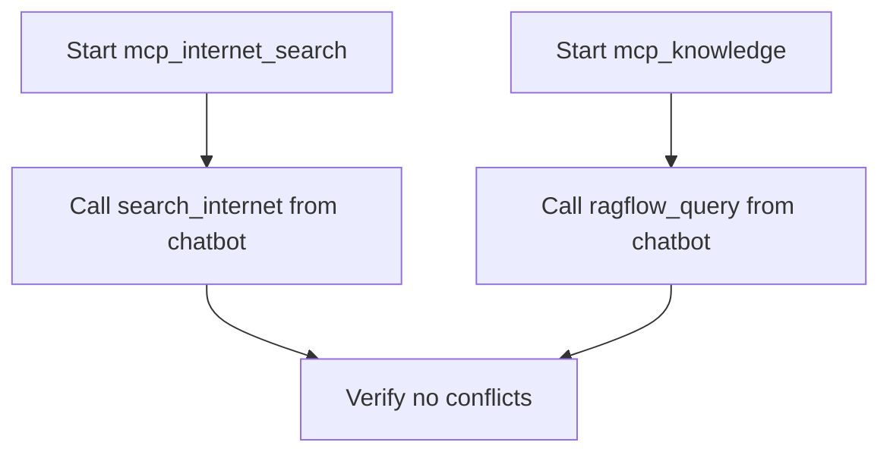
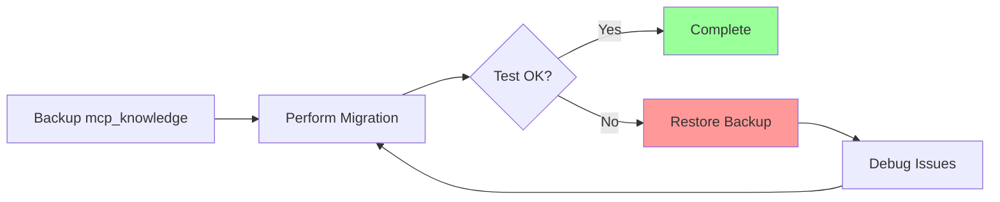

# Kiến trúc MCP Servers - Trước và Sau khi tách

## Kiến trúc HIỆN TẠI (Before)



**Vấn đề:**
- ❌ Một server xử lý 2 chức năng khác nhau
- ❌ Dependencies lẫn lộn (Serper + Ragflow)
- ❌ Khó maintain và scale
- ❌ Restart server ảnh hưởng cả 2 chức năng

---

## Kiến trúc MỚI (After)



**Lợi ích:**
- ✅ Mỗi server có trách nhiệm rõ ràng
- ✅ Dependencies độc lập
- ✅ Dễ maintain và debug
- ✅ Có thể restart/disable từng server riêng
- ✅ Scalable và reusable

---

## So sánh Dependencies

### TRƯỚC (mcp_knowledge)
```
requests          # Cho Serper
aiohttp           # Cho Ragflow
voyageai          # Cho reranking
trafilatura       # Cho web scraping
beautifulsoup4    # Cho web scraping
lxml              # Cho web scraping
mcp, fastapi, uvicorn
pydantic
python-dotenv
```
**Tổng: 10 packages chính**

### SAU

#### mcp_internet_search
```
requests          # Cho Serper
voyageai          # Cho reranking
trafilatura       # Cho web scraping
beautifulsoup4    # Cho web scraping
lxml              # Cho web scraping
mcp, fastapi, uvicorn
pydantic
python-dotenv
```
**Tổng: 9 packages**

#### mcp_knowledge
```
aiohttp           # Cho Ragflow
mcp, fastapi, uvicorn
pydantic
python-dotenv
```
**Tổng: 5 packages**

**Kết quả:** Giảm 50% dependencies cho knowledge server!

---

## Flow hoạt động

### Search Internet Flow



### Knowledge Query Flow



---

## File Structure Comparison

### TRƯỚC
```
mcp_knowledge/
├── server.py              (262 lines - CẢ HAI)
├── serper_adapter.py      (92 lines)
├── web_scrape.py          (73 lines)
├── ragflow_adapter.py     (132 lines)
├── config.py              (17 lines - CẢ HAI)
├── logger.py              (32 lines)
├── .env                   (4 keys)
├── requirements.txt       (10 packages)
└── README.md              (23 lines - CẢ HAI)
```

### SAU

```
mcp_internet_search/
├── server.py              (~150 lines - CHỈ SEARCH)
├── serper_adapter.py      (92 lines)
├── web_scrape.py          (73 lines)
├── config.py              (12 lines - CHỈ SEARCH)
├── logger.py              (32 lines)
├── .env                   (2 keys)
├── requirements.txt       (9 packages)
└── README.md              (~50 lines)

mcp_knowledge/
├── server.py              (~120 lines - CHỈ RAGFLOW)
├── ragflow_adapter.py     (132 lines)
├── config.py              (12 lines - CHỈ RAGFLOW)
├── logger.py              (32 lines)
├── .env                   (2 keys)
├── requirements.txt       (5 packages)
└── README.md              (~50 lines)
```

**Kết quả:**
- Code rõ ràng hơn (mỗi file nhỏ hơn)
- Dễ navigate và tìm code
- Giảm cognitive load khi đọc code

---

## Migration Path



**Steps:**
1. Create new `mcp_internet_search` server
2. Update existing `mcp_knowledge` server
3. Test both servers independently
4. Update MCP settings configuration
5. Restart VSCode to load new config
6. Verify both tools work correctly

---

## Testing Strategy

### Unit Tests



### Integration Tests



---

## Rollback Plan

Nếu có vấn đề, có thể rollback dễ dàng:



**Backup checklist:**
- [ ] Copy toàn bộ `mcp_knowledge/` folder
- [ ] Backup MCP settings file
- [ ] Document current working state
- [ ] Keep backup until confirmed stable

---

## Performance Impact

### Before
- **Startup time**: ~2s (load cả 2 chức năng)
- **Memory**: ~150MB (tất cả dependencies)
- **Restart impact**: Cả 2 tools bị ảnh hưởng

### After
- **Startup time**: ~1s mỗi server (nhẹ hơn)
- **Memory**: ~80MB + ~70MB (tách riêng)
- **Restart impact**: Chỉ tool bị lỗi cần restart

**Tổng kết:** Hiệu năng tốt hơn, linh hoạt hơn!
